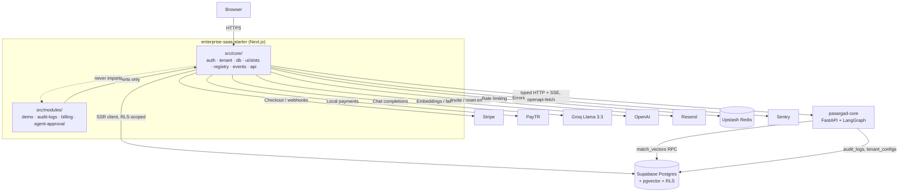

# Nimbus

Multi-tenant booking and scheduling infrastructure for teams that need
row-level tenant isolation, database-enforced double-booking prevention, and
an AI assistant grounded in their own knowledge base — built as a
**modular monolith**: a small, framework-agnostic `core` layer plus
independently pluggable feature `modules`, paired with **`pasargad-core`**,
a sibling FastAPI/LangGraph service that owns AI agent orchestration and
retrieval-augmented generation.

## Live Demo

**[Live Demo](https://enterprise-saas-starter.vercel.app)**

## Badges

[](https://github.com/Behdarvandan/enterprise-saas-starter/actions/workflows/ci-cd.yml)


No license badge is included — see [License](#license).

## Key Features

- **Multi-tenant Row-Level Security** — every tenant-scoped table
  (`appointments`, `services`, `documents`, `chat_messages`, `audit_logs`,
  `tenant_usage`, …) enables Postgres RLS with policies scoped through
  shared helper functions (`is_org_member()`, `current_user_role()`).
  Isolation is enforced in the database, not in application code.
- **Database-enforced double-booking prevention** — a `BEFORE INSERT/UPDATE`
  trigger (`prevent_appointment_overlap`) row-locks the organization and
  rejects any overlapping, non-cancelled appointment before it can be
  written.
- **AI knowledge-base assistant** — documents are chunked and embedded, then
  indexed with `pgvector`'s HNSW algorithm for cosine-similarity search
  (`match_document_chunks` RPC). Chat responses stream from Groq's
  `llama-3.3-70b-versatile`, with an automatic fallback to OpenAI's
  `gpt-4o-mini` when no Groq key is configured. An embeddable chat widget
  ships with the app.
- **AI agent gateway (`pasargad-core`)** — a separate FastAPI service
  streams structured Server-Sent Events (`thought` → `sources` → `chunk`* →
  `done`) for agent turns, and exposes a Human-in-the-Loop approval queue.
  Its OpenAPI schema is codegen'd directly into this repo's TypeScript
  types — see [AI & RAG Backend](#ai--rag-backend-pasargad-core).
- **Stripe subscription billing** — Starter/Pro/Enterprise plans, Stripe
  Checkout, the customer billing portal, and signature-verified webhooks that
  sync subscription state to each organization.
- **Metered B2B usage billing** — a separate, additive `tenant_usage` table
  tracks API-call and token counts per organization per month via a
  race-safe atomic RPC — distinct from the Stripe plan-subscription billing
  above. See [Metered Billing](#metered-billing).
- **Modular payment routing** — a payment adapter layer
  (`src/lib/payment/adapter.ts`) that switches between Stripe and PayTR (a
  Turkish local payment gateway) via `NEXT_PUBLIC_PAYMENT_PROVIDER`.
- **Public booking flow** — anonymous customers can book appointments against
  a tenant's configured services and availability windows at `/book/[org_slug]`.
- **Role-based team management** — `owner`/`admin`/`member` roles, email
  invitations sent via Resend, and a `SECURITY DEFINER` `accept_invitation`
  RPC so an invited user can join without already being a member.
- **Audit logging** — every tenant-visible action can be recorded to a
  shared `audit_logs` table (also written to directly by `pasargad-core`),
  readable/writable by tenant members via RLS, in addition to the
  operator-only path that predates this module.
- **Human-in-the-loop agent approvals** — a live-updating approval queue
  (Supabase Realtime `postgres_changes`) for agent actions awaiting a
  tenant's decision, backed by `pasargad-core`'s approval endpoints.
- **Rate-limited public API routes** — the anonymous booking-slots endpoint
  is rate-limited per organization/IP via Upstash Redis.
- **Error tracking** — Sentry is wired across the client, server, and edge
  runtimes.
- **CI/architecture gate** — GitHub Actions runs a `check:boundaries`
  architecture-isolation scan and a full build on every push and pull
  request to `main`. See [Architecture & Design Principles](#architecture--design-principles).
- **E2E tests** — Playwright covers both the original booking/billing flows
  and the newer B2B module surface (audit logs, usage tracker, approval
  queue). See [Test Infrastructure](#test-infrastructure).

## Tech Stack

| Technology | Role in this project |
| --- | --- |
| Next.js 15.5 (App Router) | Full-stack framework — React Server Components, Server Actions, API routes |
| React 19 + TypeScript | UI layer, strict typing across `src/core/`, `src/modules/`, `src/app/`, `src/lib/` |
| Tailwind CSS + Shadcn UI | Styling, design tokens, and primitives (`src/core/ui/primitives`) |
| Supabase (Postgres + `@supabase/ssr`) | Auth, database, session management, Row Level Security |
| pgvector | Vector similarity search — both the existing chat-widget RAG (`match_document_chunks`) and `pasargad-core`'s own retrieval (`match_vectors`) |
| `openapi-fetch` / `openapi-typescript` | Type-safe, codegen'd HTTP client for the `pasargad-core` API — see [OpenAPI Type Sync](#openapi-type-sync) |
| FastAPI + LangGraph (`pasargad-core`) | Sibling AI/agent backend — see [AI & RAG Backend](#ai--rag-backend-pasargad-core) |
| Stripe | Primary billing, checkout, and subscription management |
| PayTR | Alternate local payment gateway, selected via a payment adapter |
| Groq (Llama 3.3 70B) | Primary LLM for streamed AI chat responses |
| OpenAI | Document embeddings (`text-embedding-3-small`) and LLM fallback |
| Resend | Transactional email — invitations and password resets |
| Upstash Redis | Rate limiting for public API routes |
| Sentry | Error tracking (client, server, edge) |
| Playwright | End-to-end testing |
| Docker (multi-stage, standalone output) | Container image — see [Deployment](#deployment) for how this relates to the CI pipeline |
| Vercel | Historical/current production hosting (auto-deploy via GitHub integration) — see the deployment note below |
| GitHub Actions | CI — architecture boundary check, build, and (as of a later pipeline revision) an AWS ECR/ECS Fargate deploy job |

## Architecture & Design Principles

This repository follows a **Modular Monolith** architecture, codified in the
repo's own `CLAUDE.md`:

> 1. **Core Isolation Rule**: Code inside `src/core/` MUST NEVER import
>    anything from `src/modules/`. Core knows NOTHING about specific
>    business features.
> 2. **Module Boundary Rule**: Modules in `src/modules/*` can only
>    communicate with other modules via their public `index.ts` interface.
> 3. **ADHD Micro-Tasks**: Always break down tasks into 15–30 minute
>    traceable micro-steps. Design and state data flow before outputting
>    code.

In practice:

- **`src/core/`** — framework-agnostic shared infrastructure: auth types
  (`core/auth`), tenant context (`core/tenant`, React context hydrated
  server → client via a `useState` initializer, not `useEffect`, to avoid
  hydration mismatches), a Supabase client abstraction (`core/db`), a
  slot/plugin injection system (`core/ui/slots`), a module manifest registry
  with feature-flag support (`core/registry`), a typed in-memory pub/sub
  event bus (`core/events`), and a typed `pasargad-core` API client
  (`core/api`). **Nothing in this directory imports from `src/modules/`.**
- **`src/modules/`** — self-contained feature modules (`demo`, `audit-logs`,
  `billing`, `agent-approval`), each exporting a `ModuleManifest` (nav
  items, feature-flag key, slot contributions) through its own `index.ts`
  barrel. Modules may freely import from `core`, never from each other's
  internals.
- **`src/lib/`** / **`src/components/`** — the pre-existing (pre-refactor)
  application code, incrementally being migrated into `core`/`modules`.
- **Enforcement, not convention**: `scripts/check-core-boundaries.mjs` is a
  zero-dependency Node script that recursively scans every `.ts`/`.tsx`
  file under `src/core/` for a `@/modules/`, `../modules/`, or `/modules/`
  import specifier and fails the build if it finds one:

  ```bash
  npm run check:boundaries
  ```

  This runs in CI on every push/PR (see [Deployment](#deployment)), so an
  architecture violation fails the pipeline, not just a code review.
- **Bootstrap flow**: `src/instrumentation.ts`'s Next.js `register()` hook
  (nodejs runtime only) calls `registerModules()` (`src/modules/index.ts`),
  which registers every module's manifest with `moduleRegistry`, bridges
  each declared slot contribution into `SlotRegistry`, and activates each
  module's `EventBus` listeners — all before the app serves its first
  request.
- **Slot-based UI composition**: core shell components (`AppShell`,
  dashboard layout, the settings page) render `<Slot id={SHELL_SLOTS.X} />`;
  modules contribute components to named slots (`DASHBOARD_OVERVIEW`,
  `HEADER_ACTIONS`, `SETTINGS_TAB`) via their manifest, filtered at runtime
  by per-module feature flags (`ModuleRegistry.isModuleEnabled`).



## Core Modules & Features

### Auth & Supabase SSR (`@/core/db`)

`createCoreServerClient()`/`createCoreBrowserClient()` wrap `@supabase/ssr`,
duplicating (not importing) the URL/anon-key validation and cookie-handling
logic from `src/lib/supabase/*` — core cannot import `@/lib/*`, so this is a
deliberate, documented exception rather than an accidental fork. Both accept
an optional generic `TDatabase` for column-level type safety; when a caller
doesn't supply one, they fall back to `GenericDatabase`, a placeholder typed
to Supabase's own `{ public: { Tables, Views, Functions, Enums,
CompositeTypes } }` shape (not a bare `Record<string, unknown>` — an earlier
version used that and it silently collapsed every `.from()`/`.rpc()` call's
row type to `never`, since `SupabaseClient`'s internal `Schema` generic
requires the exact `GenericSchema` shape to resolve at all; fixed during the
audit-logs module's persistence work).

### Audit Logs

The `audit_logs` table (`id, organization_id, actor_id, action, target_table,
target_id, metadata, created_at`) **predates** this module and is already
written to directly by `pasargad-core` (`apps/api/main.py::_write_audit_log`,
via a `service_role`-only `write_audit_log()` RPC — no direct-table INSERT
policy existed for any other role). `src/modules/audit-logs/` adds two
**additive** tenant-scoped RLS policies (`audit_logs_select_tenant_member`,
`audit_logs_insert_tenant_member`, both gated on
`current_user_role(organization_id) is not null`) so a signed-in tenant
member can read and write their own org's entries directly through
`service.ts`'s `createAuditLog`/`getAuditLogs` — without touching the
existing operator-only policy or the `pasargad-core` write path.

### Metered Billing

A separate `tenant_usage` table (`organization_id, period_start` unique per
calendar month, `api_calls_count`, `token_usage_count`) — distinct from the
pre-existing `usage_quotas` table (which tracks RAG-chat token quotas with a
hard limit) and from Stripe's plan subscriptions. Increments go through
`increment_tenant_usage(p_organization_id, p_metric, p_count)`, a
`SECURITY DEFINER` upsert RPC granted to `authenticated` (not just
`service_role`) with an internal `is_org_member()` check — atomic on
purpose: a plain client-side read-then-update from `service.ts` would risk
losing increments under concurrent requests for the same tenant/period, the
same race class the pre-existing `increment_token_usage` RPC's own
migration comment documents.

### Agent Approval Queue

`ApprovalQueue` (rendered on the dashboard's `DASHBOARD_OVERVIEW` slot)
fetches pending tasks and submits decisions through
`pasargad-core`'s REST API (`GET /api/v1/agent/approvals`,
`POST /api/v1/agent/approvals/{task_id}/decision`, both currently
placeholder/unpersisted on the backend), and also opens a Supabase Realtime
channel — `.channel(...).on("postgres_changes", { table: "agent_approvals",
filter: "organization_id=eq.<tenant>" }, refetch)` — to auto-refresh on
live changes. **No `agent_approvals` Postgres table exists yet**; this is a
deliberate forward-compatible placeholder (documented in the component) that
starts firing the moment persistence lands on either side, without any
frontend code changing.

## AI & RAG Backend (`pasargad-core`)

A sibling repository (`/Users/pouriya/pasargad-core`) — a FastAPI service
(`apps/api/main.py`) orchestrating a **LangGraph** `StateGraph`: requests are
routed (`route_intent`) to one of two node branches, informally named the
"Ops Crew" and "Dev Crew" (`packages/graph/nodes/{ops,dev}.py`) — this is
LangGraph routing terminology specific to this codebase, **not** the CrewAI
framework (no `crewai` dependency exists anywhere in `pasargad-core`).

Key pieces:

- **Agent Gateway router** (`apps/api/routers/agent.py`,
  `prefix="/api/v1/agent"`): `POST /stream` (requires `X-Tenant-ID`,
  returns a `text/event-stream` `StreamingResponse`), `GET /approvals`,
  `POST /approvals/{task_id}/decision` — Pydantic v2 schemas in
  `apps/api/schemas/agent.py`.
- **Structured SSE protocol**: each agent turn streams four JSON event
  types, in order — `{"type":"thought",...}` → `{"type":"sources",
  "sources":[{"title","similarity"}, ...]}` → one or more
  `{"type":"chunk","content":...}` → `{"type":"done"}`. The `sources`
  payload's shape mirrors `packages/graph/nodes/ops.py`'s real
  `match_vectors`-backed retrieval (tenant-isolated via
  `filter_tenant_id`), though the stream endpoint currently emits sample
  data rather than a live pgvector query.
- **Typed client + SSE gateway**: `src/core/api/client.ts`
  (`createPasargadClient`) wraps `openapi-fetch`'s `createClient<paths>()`
  with conditional `Authorization`/`X-Tenant-ID` header injection;
  `src/core/api/gateway.ts` (`streamPasargadAgent`) is a raw-`fetch`-based
  SSE caller, since `openapi-fetch`'s typed client isn't built for
  arbitrary streaming responses. Module code (e.g.
  `src/modules/agent-approval/service.ts`) consumes these against the real
  generated `paths` type (see [OpenAPI Type Sync](#openapi-type-sync)
  below), mapping the backend's snake_case Pydantic field names to this
  repo's camelCase module types explicitly.
- **Env var note**: the codebase currently has two different names for
  `pasargad-core`'s base URL — `PASARGAD_API_URL` (server-only, used by
  `core/api/client.ts` and the pre-existing `/api/chat/rag` proxy) and
  `NEXT_PUBLIC_PASARGAD_API_URL` (used by `core/api/gateway.ts`). Only
  `PASARGAD_API_URL` is documented in `.env.example` today — worth
  reconciling before relying on the `NEXT_PUBLIC_` one in production, since
  that prefix inlines the value into the client bundle unnecessarily for a
  server-only call path.
- **Existing chat-widget RAG** (predates `pasargad-core`, unchanged): still
  uses its own `match_document_chunks` pgvector HNSW RPC and Groq/OpenAI
  directly from this repo — a separate retrieval path from
  `pasargad-core`'s `match_vectors`.

### OpenAPI Type Sync

```bash
PASARGAD_OPENAPI_URL=http://localhost:8000/openapi.json npm run generate:api
```

Runs `openapi-typescript` against `pasargad-core`'s live `/openapi.json`
and overwrites `src/core/api/schema.d.ts` in place — the file starts as a
lint-disabled `export interface paths {}` placeholder and becomes the real
generated `paths`/`components`/`operations` types once this runs against a
running backend. Re-run it after any change to `pasargad-core`'s FastAPI
schema so this repo's typed API calls (`createPasargadClient`'s
`client.GET`/`client.POST`) stay in sync.

Running `pasargad-core` locally:

```bash
cd /Users/pouriya/pasargad-core
venv/bin/uvicorn apps.api.main:app --port 8000
```

## Test Infrastructure

Playwright (`e2e/`) covers the original booking/billing/auth flows plus a
newer B2B-module spec, `e2e/b2b-modules.spec.ts`:

- **Auth guards** (always run, no setup required): `/dashboard` and
  `/dashboard/settings` redirect unauthenticated visitors to `/login` —
  the same pattern every other dashboard-adjacent spec in this repo uses.
- **Authenticated content** (`E2E_TEST_EMAIL`/`E2E_TEST_PASSWORD`-gated,
  `test.skip(...)` when unset): logs in via the real `/login` form, then
  asserts the audit-log table and usage tracker render on
  `/dashboard/settings`, and the Agent Approval Queue's empty state
  renders on `/dashboard`. **No seeded test user exists in this repo yet**
  — these tests report as *skipped*, not passing, until
  `E2E_TEST_EMAIL`/`E2E_TEST_PASSWORD` point at a real account. Approve/
  Reject button interactions aren't covered end-to-end, since
  `pasargad-core`'s `/approvals` endpoint has no persistence layer yet to
  seed a real pending task from.

```bash
npx playwright install --with-deps chromium
npx playwright test                      # full suite
npx playwright test e2e/b2b-modules.spec.ts
```

There is no `npm run test:e2e` script — `npx playwright test` is the
canonical entrypoint (`npm test` runs the separate Vitest unit suite).

## Production Readiness & Hardening

- **Security headers** (`next.config.js`, `async headers()`, applied to
  `/:path*`): `X-Frame-Options: DENY`, `X-Content-Type-Options: nosniff`,
  `Referrer-Policy: strict-origin-when-cross-origin`,
  `Strict-Transport-Security: max-age=63072000; includeSubDomains;
  preload`. Verified against a real `next start` response, not just config
  parsing. (No page in this app is meant to be iframed by an external
  site, and the PayTR checkout flow embeds *PayTR's* hosted page in an
  iframe on our side — outbound framing, unaffected by our own
  `X-Frame-Options`.)
- **Standalone output** (`output: "standalone"` in `next.config.js`) feeds
  the multi-stage `Dockerfile` (`deps` → `builder` → `runner`, `node:20
  -alpine`, non-root `nextjs:nodejs` UID/GID 1001, `HEALTHCHECK` against
  `GET /api/health`).
- **Migration integrity**: `supabase/migrations/*.sql` filenames are
  `YYYYMMDDHHMMSS_description.sql` and apply in lexicographic order.
  Verified: no duplicate timestamp prefixes, chronological order intact
  through the newest files (`20261124000000_audit_logs_tenant_access.sql`,
  `20261124000100_tenant_usage.sql`).
- **Architecture gate**: `npm run check:boundaries` — see
  [Architecture & Design Principles](#architecture--design-principles).

## Getting Started

1. **Clone and install dependencies**

   ```bash
   git clone https://github.com/Behdarvandan/enterprise-saas-starter.git
   cd enterprise-saas-starter
   npm install
   ```

2. **Configure environment variables**

   ```bash
   cp .env.example .env.local
   ```

   Fill in real values in `.env.local`. Variable names, grouped by concern
   (see `.env.example` for full details and links to where to obtain each):

   | Variable | Purpose |
   | --- | --- |
   | `NEXT_PUBLIC_SUPABASE_URL`, `NEXT_PUBLIC_SUPABASE_ANON_KEY`, `SUPABASE_SERVICE_ROLE_KEY` | Supabase project connection and privileged server operations |
   | `STRIPE_SECRET_KEY`, `NEXT_PUBLIC_STRIPE_PUBLISHABLE_KEY`, `STRIPE_WEBHOOK_SECRET`, `STRIPE_PRICE_PRO`, `STRIPE_PRICE_ENTERPRISE` | Stripe billing and checkout |
   | `NEXT_PUBLIC_PAYMENT_PROVIDER`, `PAYTR_MERCHANT_ID`, `PAYTR_MERCHANT_KEY`, `PAYTR_MERCHANT_SALT` | Payment provider routing and PayTR credentials |
   | `RESEND_API_KEY`, `EMAIL_FROM` (optional) | Transactional email |
   | `GOOGLE_API_KEY` | Document embeddings (Gemini `gemini-embedding-001`, 1536d) |
   | `OPENAI_API_KEY`, `GROQ_API_KEY` | AI chat completions |
   | `NEXT_PUBLIC_SENTRY_DSN`, `SENTRY_DSN`, `SENTRY_ORG`, `SENTRY_PROJECT`, `SENTRY_AUTH_TOKEN` | Error tracking and source map upload |
   | `CRON_SECRET` | Authorizes the pending-appointment cleanup cron endpoint |
   | `UPSTASH_REDIS_REST_URL`, `UPSTASH_REDIS_REST_TOKEN` | Rate limiting for public API routes |
   | `PASARGAD_API_URL` | Base URL of the `pasargad-core` FastAPI service (see the env var naming note above) |
   | `PASARGAD_OPENAPI_URL` (codegen-time only) | Where `npm run generate:api` fetches `/openapi.json` from — defaults to `http://localhost:8000/openapi.json` |
   | `E2E_TEST_EMAIL`, `E2E_TEST_PASSWORD` (optional, local/CI only) | Enables the authenticated Playwright tests in `e2e/b2b-modules.spec.ts` |

3. **Apply database migrations** (requires the [Supabase CLI](https://supabase.com/docs/guides/cli))

   ```bash
   supabase link --project-ref <project-ref>
   supabase db push
   ```

4. **(Optional) Run `pasargad-core` locally** — required for the AI agent
   gateway, SSE streaming, and OpenAPI type regeneration:

   ```bash
   cd /Users/pouriya/pasargad-core
   venv/bin/uvicorn apps.api.main:app --port 8000
   ```

5. **Run the dev server**

   ```bash
   npm run dev
   ```

   Open [http://localhost:3000](http://localhost:3000).

6. **Lint, build, and test**

   ```bash
   npm run lint
   npm run check:boundaries   # architecture isolation gate
   npm run build
   npm run start              # run the production build locally

   npx playwright install --with-deps chromium
   npx playwright test        # end-to-end tests
   ```

7. **Regenerate `pasargad-core` API types** (after any change to its
   FastAPI schema — requires step 4 running):

   ```bash
   PASARGAD_OPENAPI_URL=http://localhost:8000/openapi.json npm run generate:api
   ```

## Deployment

**This repo currently has two deployment stories, and they haven't been
reconciled** — documented honestly rather than picking one to assert:

- The live demo above is hosted on **Vercel**, historically auto-deployed
  on push to `main` via Vercel's GitHub integration, with env vars managed
  in the Vercel project settings.
- `.github/workflows/ci-cd.yml` was later rewritten to a two-job pipeline
  targeting **AWS ECS Fargate**:
  1. `quality-gate` — checkout, Node 20 + npm cache, `npm ci`,
     `npm run check:boundaries`, `npm run build`.
  2. `build-and-deploy` (`needs: quality-gate`, `main`-push only) — OIDC
     `aws-actions/configure-aws-credentials`, `amazon-ecr-login`, Docker
     build/push (tagged with both the commit SHA and `latest`), then
     `aws ecs update-service --force-new-deployment`. This job depends on
     `AWS_ROLE_ARN`, `AWS_REGION`, `ECR_REPOSITORY`, `ECS_CLUSTER`,
     `ECS_SERVICE` GitHub Secrets — whether these are actually populated in
     the live repo, and whether Vercel's auto-deploy is still active, isn't
     something this README can verify from the codebase alone. Confirm
     both before assuming either path is authoritative.

The Vercel CLI is included as a dev dependency either way:

```bash
# One-time: link this checkout to the Vercel project
npx vercel link

# Inspect or manage environment variables
npx vercel env ls
npx vercel env add <NAME> production

# Trigger a production deploy by hand
npx vercel --prod
```

### Local container image

The app also builds into a minimal, non-root production image via a
multi-stage `Dockerfile` (`deps` → `builder` → `runner`), using Next.js's
`output: "standalone"` build, with a `HEALTHCHECK` against `GET /api/health`
— the same image the AWS pipeline above builds and pushes to ECR:

```bash
# Local container run
docker compose up --build

# Manual image build (public NEXT_PUBLIC_* values are build-time args)
docker build \
  --build-arg NEXT_PUBLIC_SUPABASE_URL=... \
  --build-arg NEXT_PUBLIC_SUPABASE_ANON_KEY=... \
  --build-arg NEXT_PUBLIC_STRIPE_PUBLISHABLE_KEY=... \
  -t nimbus .
```

## Project Structure

```text
.
├── src/
│   ├── core/               # Framework-agnostic shared layer — never imports src/modules/
│   │   ├── auth/            # Shared auth types (CoreUser, CoreSession, TenantRole)
│   │   ├── tenant/           # TenantProvider/useTenant, recordTenantUsage
│   │   ├── db/                # createCoreServerClient/createCoreBrowserClient, GenericDatabase
│   │   ├── api/                # pasargad-core client (openapi-fetch), SSE gateway, generated schema.d.ts
│   │   ├── events/              # Typed in-memory pub/sub EventBus
│   │   ├── registry/             # ModuleManifest contract + ModuleRegistry (feature flags, nav)
│   │   └── ui/
│   │       ├── primitives/        # Shadcn-based primitives (Card, Button, Table, Progress, ...)
│   │       ├── shell/               # AppShell, Header, Sidebar, TenantSwitcher
│   │       └── slots/                # Slot/SlotRegistry, SHELL_SLOTS constants
│   ├── modules/             # Self-contained feature modules — import only from core
│   │   ├── demo/              # Reference module proving the bootstrap/slot/registry system
│   │   ├── audit-logs/         # AuditLogTable, service.ts, RLS-backed persistence
│   │   ├── billing/             # UsageTracker, service.ts, tenant_usage persistence
│   │   └── agent-approval/       # ApprovalQueue, service.ts, pasargad-core + Realtime
│   ├── app/                # Routes: (marketing), dashboard, book/[org_slug], api/*
│   ├── components/         # Pre-refactor UI: dashboard shell, chat widget, layout
│   ├── lib/                 # Pre-refactor: Supabase clients, Stripe/PayTR, RAG, booking, team, rate-limit
│   ├── types/                # Generated database types + shared contracts
│   └── middleware.ts          # Supabase session-refresh + tenant resolution middleware
├── supabase/
│   └── migrations/          # Schema, RLS, subscriptions, invitations, AI/RAG, appointments,
│                               audit-logs tenant access, tenant_usage
├── e2e/                     # Playwright specs, incl. b2b-modules.spec.ts
├── scripts/
│   └── check-core-boundaries.mjs  # Architecture isolation CI gate
├── public/                  # Static assets
├── .github/workflows/       # CI/CD pipeline (ci-cd.yml) — see Deployment
├── Dockerfile                # Multi-stage build → standalone runtime image
├── docker-compose.yml         # Local containerized run
├── next.config.js             # Next.js + Sentry config, standalone output, security headers
└── tailwind.config.js          # Design tokens
```

Inside `src/app/`:

- `(marketing)/` — landing page, pricing, login/signup, password reset, invitations.
- `dashboard/` — authenticated app: overview (renders `DASHBOARD_OVERVIEW`
  slot contributions), team, bookings, AI chatbot, billing (Stripe plans —
  not the `billing` module), settings (renders `SETTINGS_TAB` slot
  contributions).
- `book/[org_slug]/` — anonymous customer-facing booking flow.
- `api/` — checkout, billing portal, Stripe/PayTR webhooks, booking slots,
  RAG chat and ingestion, health check, cleanup cron, and
  `api/pasargad/stream` (proxies `pasargad-core`'s agent SSE endpoint).

## License

This repository does not currently include a `LICENSE` file and is marked
`"private": true` in `package.json`. All rights are reserved by the
repository owner unless and until a license is added.
