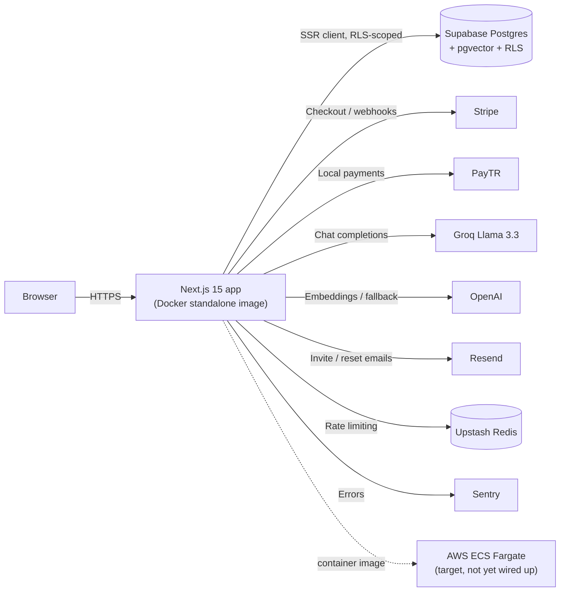

# Nimbus

Multi-tenant booking and scheduling infrastructure for teams that need
row-level tenant isolation, database-enforced double-booking prevention, and
an AI assistant grounded in their own knowledge base.

## Live Demo

**[[[<LIVE_DEMO_URL>](https://enterprise-saas-starter.vercel.app/)]**


## Badges

[](https://github.com/Behdarvandan/enterprise-saas-starter/actions/workflows/ci-cd.yml)


No license badge is included — see [License](#license).

## Key Features

- **Multi-tenant Row-Level Security** — every tenant-scoped table
  (`appointments`, `services`, `documents`, `chat_messages`, …) enables
  Postgres RLS with policies scoped through a shared `is_org_member()`
  function. Isolation is enforced in the database, not in application code.
- **Database-enforced double-booking prevention** — a `BEFORE INSERT/UPDATE`
  trigger (`prevent_appointment_overlap`) row-locks the organization and
  rejects any overlapping, non-cancelled appointment before it can be
  written.
- **AI knowledge-base assistant** — documents are chunked and embedded, then
  indexed with `pgvector`'s HNSW algorithm for cosine-similarity search
  (`match_document_chunks` RPC). Chat responses stream from Groq's
  `llama-3.3-70b-versatile`, with an automatic fallback to OpenAI's
  `gpt-4o-mini` when no Groq key is configured. An embeddable chat widget
  ships with the app.
- **Stripe subscription billing** — Starter/Pro/Enterprise plans, Stripe
  Checkout, the customer billing portal, and signature-verified webhooks that
  sync subscription state to each organization.
- **Modular payment routing** — a payment adapter layer
  (`src/lib/payment/adapter.ts`) that switches between Stripe and PayTR (a
  Turkish local payment gateway) via `NEXT_PUBLIC_PAYMENT_PROVIDER`.
- **Public booking flow** — anonymous customers can book appointments against
  a tenant's configured services and availability windows at `/book/[org_slug]`.
- **Role-based team management** — `owner`/`admin`/`member` roles, email
  invitations sent via Resend, and a `SECURITY DEFINER` `accept_invitation`
  RPC so an invited user can join without already being a member.
- **Rate-limited public API routes** — the anonymous booking-slots endpoint
  is rate-limited per organization/IP via Upstash Redis.
- **Error tracking** — Sentry is wired across the client, server, and edge
  runtimes.
- **CI + E2E tests** — GitHub Actions runs lint, build, and a Playwright E2E
  suite on every push and pull request to `main`.

## Tech Stack

| Technology | Role in this project |
| --- | --- |
| Next.js 15.5 (App Router) | Full-stack framework — React Server Components, Server Actions, API routes |
| React 19 + TypeScript | UI layer, strict typing across `app/`, `lib/`, and `types/` |
| Tailwind CSS | Styling and design tokens |
| Supabase (Postgres + `@supabase/ssr`) | Auth, database, session management, Row Level Security |
| pgvector | Vector similarity search for the AI knowledge base |
| Stripe | Primary billing, checkout, and subscription management |
| PayTR | Alternate local payment gateway, selected via a payment adapter |
| Groq (Llama 3.3 70B) | Primary LLM for streamed AI chat responses |
| OpenAI | Document embeddings (`text-embedding-3-small`) and LLM fallback |
| Resend | Transactional email — invitations and password resets |
| Upstash Redis | Rate limiting for public API routes |
| Sentry | Error tracking (client, server, edge) |
| Playwright | End-to-end testing |
| Docker (multi-stage, standalone output) | Production container image |
| AWS ECS Fargate | Intended container hosting target (see [Deployment](#deployment)) |
| GitHub Actions | CI (lint, build, E2E) and a placeholder CD stage |

## Architecture

The Next.js app is the single deployable unit: it renders the marketing site
and dashboard, exposes API routes for checkout/webhooks/booking/chat, and
talks directly to Supabase Postgres using the SSR client. AI chat requests
retrieve relevant document chunks from Postgres via `pgvector`, then stream a
completion from Groq (or OpenAI as fallback). Billing events arrive as
signature-verified webhooks from Stripe or PayTR and are written back to the
tenant's `organizations` row.



## Getting Started

1. **Clone and install dependencies**

   ```bash
   git clone https://github.com/Behdarvandan/enterprise-saas-starter.git
   cd enterprise-saas-starter
   npm install
   ```

2. **Configure environment variables**

   ```bash
   cp .env.example .env.local
   ```

   Fill in real values in `.env.local`. Variable names, grouped by concern
   (see `.env.example` for full details and links to where to obtain each):

   | Variable | Purpose |
   | --- | --- |
   | `NEXT_PUBLIC_SUPABASE_URL`, `NEXT_PUBLIC_SUPABASE_ANON_KEY`, `SUPABASE_SERVICE_ROLE_KEY` | Supabase project connection and privileged server operations |
   | `STRIPE_SECRET_KEY`, `NEXT_PUBLIC_STRIPE_PUBLISHABLE_KEY`, `STRIPE_WEBHOOK_SECRET`, `STRIPE_PRICE_PRO`, `STRIPE_PRICE_ENTERPRISE` | Stripe billing and checkout |
   | `NEXT_PUBLIC_PAYMENT_PROVIDER`, `PAYTR_MERCHANT_ID`, `PAYTR_MERCHANT_KEY`, `PAYTR_MERCHANT_SALT` | Payment provider routing and PayTR credentials |
   | `RESEND_API_KEY`, `EMAIL_FROM` (optional) | Transactional email |
   | `OPENAI_API_KEY`, `GROQ_API_KEY` | Document embeddings and AI chat completions |
   | `NEXT_PUBLIC_SENTRY_DSN`, `SENTRY_DSN`, `SENTRY_ORG`, `SENTRY_PROJECT`, `SENTRY_AUTH_TOKEN` | Error tracking and source map upload |
   | `CRON_SECRET` | Authorizes the pending-appointment cleanup cron endpoint |
   | `UPSTASH_REDIS_REST_URL`, `UPSTASH_REDIS_REST_TOKEN` | Rate limiting for public API routes |

3. **Apply database migrations** (requires the [Supabase CLI](https://supabase.com/docs/guides/cli))

   ```bash
   supabase link --project-ref <project-ref>
   supabase db push
   ```

4. **Run the dev server**

   ```bash
   npm run dev
   ```

   Open [http://localhost:3000](http://localhost:3000).

5. **Lint, build, and test**

   ```bash
   npm run lint
   npm run build
   npm run start          # run the production build locally

   npx playwright install
   npx playwright test    # end-to-end tests
   ```

## Deployment

The app builds into a minimal, non-root production image via a multi-stage
`Dockerfile` (`deps` → `builder` → `runner`), using Next.js's
`output: "standalone"` build. The image exposes port `3000` and a Docker
`HEALTHCHECK` against `GET /api/health`.

```bash
# Local container run
docker compose up --build

# Manual image build (public NEXT_PUBLIC_* values are build-time args)
docker build \
  --build-arg NEXT_PUBLIC_SUPABASE_URL=... \
  --build-arg NEXT_PUBLIC_SUPABASE_ANON_KEY=... \
  --build-arg NEXT_PUBLIC_STRIPE_PUBLISHABLE_KEY=... \
  -t nimbus .
```

**CI/CD** (`.github/workflows/ci-cd.yml`) runs on every push and pull request
to `main`:

1. `build` — install, lint, build.
2. `e2e` — install, build, run the Playwright suite.
3. `deploy` — gated to `push` on `main`, runs only after `e2e` passes.

The `deploy` job is currently a **placeholder**: it checks out the repo and
prints a message, and contains commented-out steps for the intended flow
(configure AWS credentials, log in to Amazon ECR, build/tag/push the Docker
image, then `aws ecs update-service --force-new-deployment`). To make
deployment live, uncomment and configure those steps with a real AWS role,
ECR repository, and ECS cluster/service, and add the corresponding secrets to
the repository.

## Project Structure

```text
.
├── src/
│   ├── app/              # Routes: (marketing), dashboard, book/[org_slug], api/*
│   ├── components/       # UI primitives, dashboard shell, chat widget, layout
│   ├── lib/               # Supabase clients, Stripe/PayTR, RAG, booking, team, rate-limit
│   ├── types/             # Generated database types + shared contracts
│   └── middleware.ts      # Supabase session-refresh middleware
├── supabase/
│   └── migrations/        # Schema, RLS policies, subscriptions, invitations, AI/RAG, appointments
├── e2e/                    # Playwright end-to-end specs
├── public/                 # Static assets
├── .github/workflows/      # CI/CD pipeline (ci-cd.yml)
├── Dockerfile               # Multi-stage build → standalone runtime image
├── docker-compose.yml       # Local containerized run
├── next.config.js           # Next.js + Sentry config (standalone output)
└── tailwind.config.js       # Design tokens
```

Inside `src/app/`:

- `(marketing)/` — landing page, pricing, login/signup, password reset, invitations.
- `dashboard/` — authenticated app: overview, team, bookings, AI chatbot, billing, settings.
- `book/[org_slug]/` — anonymous customer-facing booking flow.
- `api/` — checkout, billing portal, Stripe/PayTR webhooks, booking slots, RAG chat and ingestion, health check, cleanup cron.

## License

This repository does not currently include a `LICENSE` file and is marked
`"private": true` in `package.json`. All rights are reserved by the
repository owner unless and until a license is added.
